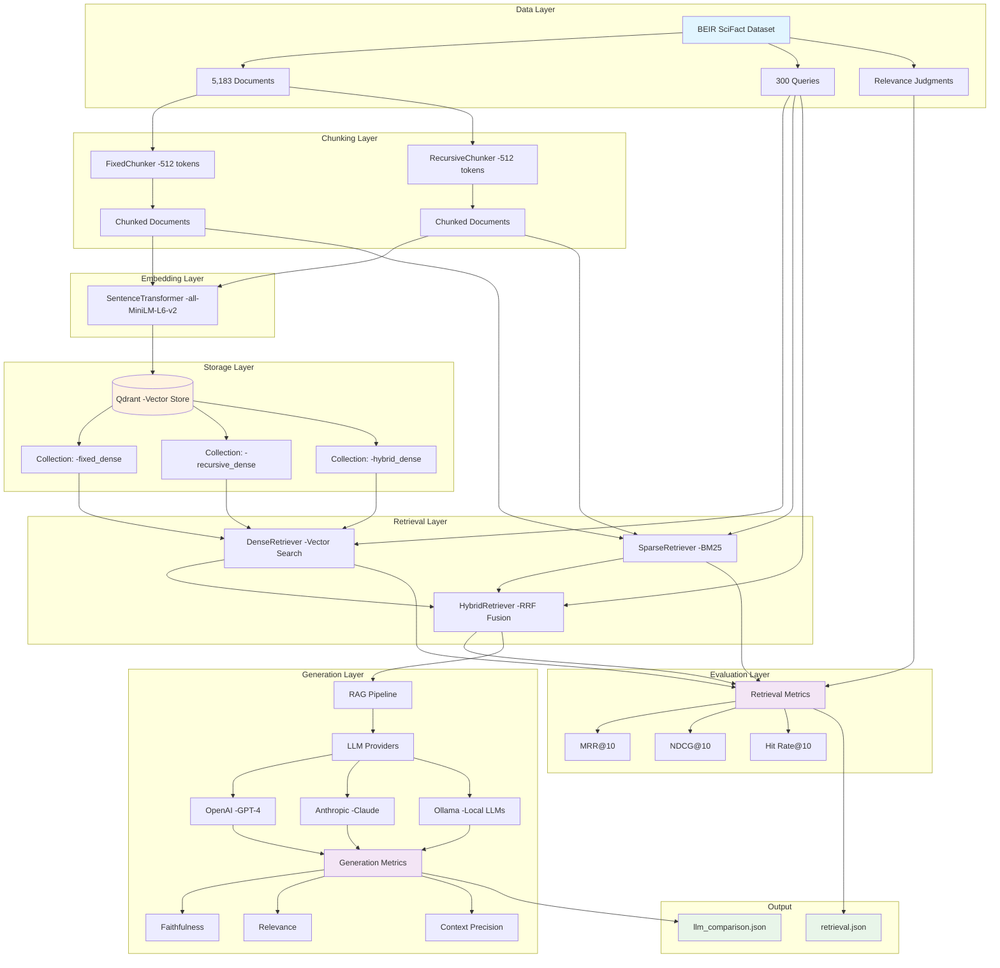
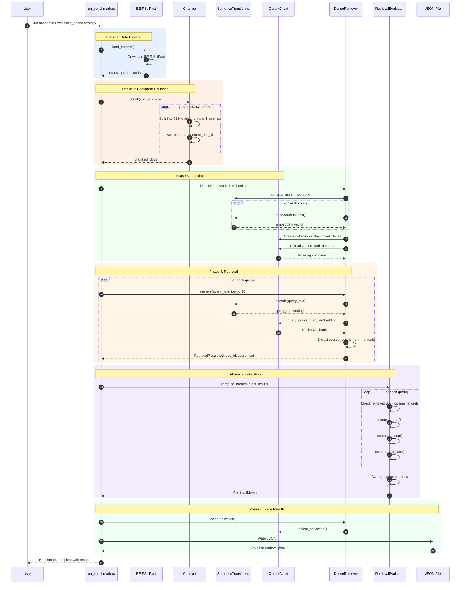

# RAG Evaluation System Diagrams

## Architecture Diagram

This diagram shows the overall system architecture and component relationships.

## Execution Flow Diagram

This diagram shows the step-by-step execution flow during a retrieval benchmark run.

## Key Components Explained

### Data Flow

1. **BEIR SciFact Dataset** → Scientific fact-checking dataset with 5,183 documents and 300 queries
2. **Chunking** → Documents split into 512-token chunks with 50-token overlap for better retrieval
3. **Embedding** → Each chunk encoded into 384-dimensional vectors using sentence-transformers
4. **Vector Store** → Qdrant stores embeddings and enables fast similarity search
5. **Retrieval** → Queries converted to embeddings and matched against stored vectors
6. **Evaluation** → Retrieved document IDs matched against ground truth relevance judgments

### Critical Design Decisions

- **source_doc_id in metadata**: Chunks get new IDs, but original doc ID preserved for metrics matching
- **Multiple strategies**: Test fixed vs recursive chunking, dense vs sparse vs hybrid retrieval
- **From-scratch metrics**: MRR, NDCG, Hit Rate implemented manually (not using BEIR's evaluator)
- **RRF fusion**: Hybrid retrieval combines dense + sparse using Reciprocal Rank Fusion

### Metrics Explained

- **MRR@10** (Mean Reciprocal Rank): 1 / rank of first relevant document
- **NDCG@10** (Normalized Discounted Cumulative Gain): Quality-weighted ranking score
- **Hit Rate@10**: Percentage of queries with at least one relevant doc in top-10
